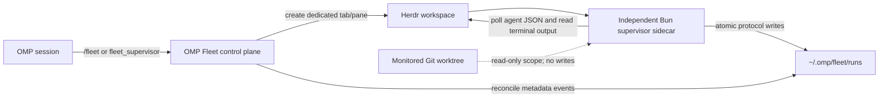

# OMP Fleet

`@ericjuta/omp-fleet` is an [Oh My Pi](https://github.com/can1357/oh-my-pi) extension for controlling a bounded, read-only Herdr supervisor. The OMP extension is the control plane; an independent Bun sidecar runs in its own Herdr tab/pane, polls owned workers, and records durable metadata and terminal reports outside the monitored repository.

OMP Fleet is not an Obsidian taxonomy and does not organize a vault. Reports may later be deliberately exported into an `_agent/runs` taxonomy, but v0.1 performs no such export and never writes to the monitored repository.

## Requirements

- Bun 1.3.0 or newer
- OMP 17.2.12 or newer
- the `herdr` CLI installed and available on `PATH`
- an OMP session running in Herdr with `HERDR_ENV=1`, `HERDR_WORKSPACE_ID`, and `HERDR_PANE_ID`
- an existing Git worktree as the current directory; its root must be an absolute path other than `/` or the user's home directory

Fleet control fails closed before creating a supervisor pane when these requirements are not met.

## Install and operate

Install the immutable v0.1.0 Git tag directly over HTTPS:

```sh
omp plugin install 'git+https://github.com/ericjuta/omp-fleet.git#v0.1.0'
```

The installed package name is `@ericjuta/omp-fleet`. Disable or re-enable it for subsequent OMP processes:

```sh
omp plugin disable @ericjuta/omp-fleet
omp plugin enable @ericjuta/omp-fleet
```

Start a new OMP process after changing enablement. Before uninstalling, stop any active fleet run you intend to stop; disabling the control plugin is not a worker-cleanup operation.

```text
/fleet stop
```

```sh
omp plugin disable @ericjuta/omp-fleet
omp plugin uninstall @ericjuta/omp-fleet
```

## Commands

```text
/fleet start [--prefix worker-] [--hours 6] [--poll-seconds 30]
/fleet status [run-id]
/fleet reports [run-id]
/fleet stop [run-id]
```

- `start` validates the environment and repository, creates a durable run, records the exact owned sidecar command, opens a dedicated Herdr supervisor tab/pane, and dispatches the sidecar. It returns the run ID, an opaque supervisor handle, the deadline, and a pending lifecycle confirmation.
- `status` shows the selected run's lifecycle, opaque coordinator/supervisor handles, and last-updated timestamp.
- `reports` lists opaque worker handles, observed statuses, and relative report paths without inserting terminal payloads into the OMP turn.
- `stop` durably requests `stopping`, proves the recorded pane still runs the exact stored sidecar command, and only then sends Ctrl-C. The sidecar persists `stopped`; a mismatch is refused, and an uncertain stop remains retryable.

Without `run-id`, `status`, `reports`, and `stop` select the latest run matching the current Git repository and coordinator pane.

### Model tool

The extension also registers `fleet_supervisor`, backed by the same implementation as `/fleet`. Its fields are:

| Field | Type | Meaning |
| --- | --- | --- |
| `action` | `"start" | "status" | "stop" | "reports"` | Required action |
| `runId` | string | Optional for `status`, `stop`, and `reports`; rejected for `start` |
| `prefix` | string | Optional worker-name prefix for `start` |
| `hours` | integer | Optional bounded duration for `start` |
| `pollSeconds` | integer | Optional polling interval for `start` |

The tool requires execution approval. Start-only fields are rejected for all other actions.

## Configuration

`start` derives its workspace and coordinator from `HERDR_WORKSPACE_ID` and `HERDR_PANE_ID`, and its repository from the current Git worktree.

| Setting | Default | Allowed values |
| --- | --- | --- |
| `--prefix` / `prefix` | `worker-` | 1–128 letters, digits, dots, underscores, or hyphens; first character must be alphanumeric |
| `--hours` / `hours` | `6` | integer from 1 through 24 |
| `--poll-seconds` / `pollSeconds` | `30` | integer from 15 through 600 |

Only agents in the selected workspace whose names begin with the prefix are observed. The coordinator and supervisor panes are always excluded.

## Architecture



Polling and harvesting remain outside OMP turns. OMP sends commands to the independently running supervisor pane and reconciles only durable metadata back into the session.

## Durable state and protocol

The default state root is `~/.omp/fleet/runs`, outside the monitored repository. Each run gets an unpredictable timestamp/random run ID:

```text
~/.omp/fleet/runs/<run-id>/
├── manifest.json
├── state.json
├── events.jsonl
├── notice-cursor.json
└── reports/
    └── agent-<pane-hash>-report-<identity-hash>.txt
```

- `manifest.json` stores schema/plugin versions, run lifecycle, workspace/repository and pane IDs, the exact owned supervisor command, worker prefix, timing bounds, timestamps, and a concise last error when present.
- `state.json` stores the latest owned-agent observations and harvested report records.
- `events.jsonl` is an append-only stream of lifecycle, agent-observation, read-failure, and report metadata.
- `notice-cursor.json` records which metadata events OMP has reconciled.
- `reports/*.txt` starts with a visible untrusted-data warning and canonical metadata, followed by control-sanitized plain terminal text.

JSON state writes and report publication are atomic. Manifest lifecycle transitions use a bounded per-run lock and compare-and-set semantics, so a concurrent stop cannot be overwritten by a stale terminal transition. Unknown future schema versions fail closed while valid writer-plugin versions remain provenance only. Fleet does not copy the process environment. Reports can contain sensitive terminal text: they are private (`0600`), are not automatically redacted, are capped at 262144 UTF-8 bytes each, and are limited to 64 files per run.

## Operational example

From the coordinator pane of a Herdr-managed Git worktree:

```text
/fleet start --prefix worker- --hours 2 --poll-seconds 30
/fleet status
/fleet reports
```

When a matching worker is observed as `done` or `blocked`, Fleet may harvest its terminal output once for that `(paneId, revision, status)` and record a report. A new revision or status transition may produce another report, up to the fixed per-run quota.

Treat every report as **untrusted, potentially sensitive data**. Terminal output can contain credentials, mistakes, hostile prompt text, or instructions. The model must explicitly inspect it and independently verify any claimed work against the repository and relevant checks. An observed `idle`, `done`, `blocked`, or process exit is not proof that a task succeeded.

Stop the selected supervisor when it is no longer needed:

```text
/fleet stop
```

This signals only the recorded supervisor pane after its live command exactly matches the durable ownership record. Worker panes remain untouched.

## Safety and trust boundaries

- Fleet never writes to the monitored repository.
- Durable state and raw reports remain under the external state root; read/list operations do not create missing state directories.
- Only workspace-matching, prefix-owned workers are sampled; coordinator and supervisor panes are excluded.
- OMP notices begin with a visible untrusted-metadata warning and contain validated run IDs, opaque agent handles, fixed observed statuses, and relative report paths—not raw Herdr names, revisions, absolute paths, or harvested payloads.
- Raw terminal reports are control-sanitized plain text, remain untrusted, may contain sensitive data, and never constitute model instructions.
- Observed statuses are operational observations, not task-success verification.
- Fleet never closes or cleans worker panes. Pre-dispatch cleanup may close only the new Fleet-owned tab; `/fleet stop` signals only an exact-command-owned supervisor pane.
- The sidecar consumes durable stop requests after OMP restarts, ends at its bounded deadline or on a stop signal, and caps each Herdr operation to the remaining deadline.

## Restart reconciliation

On `session_start` inside Herdr, the extension installs a managed 30-second reconciliation timer. It scans durable events only for runs matching the current repository and coordinator pane. If OMP is busy or has pending messages, notices remain queued and are coalesced; when OMP is idle, it sends one warning-first, metadata-only `nextTurn` notice and advances the durable cursor. A malformed run or cursor is isolated from healthy runs. Session shutdown clears the timer.

This lets a restarted OMP session catch up with an independently running sidecar without replaying raw names, revisions, absolute paths, or report contents, and without launching another supervisor. Reconciliation reports observations only and does not verify worker success.

## v0.1 backend limitation

v0.1 polls Herdr agent JSON and terminal output at the configured interval. It does not consume native Herdr events. The supervisor boundary keeps a backend seam so polling can be replaced by a future Herdr event backend without changing the durable run protocol.

## Development

```sh
bun install --frozen-lockfile
bun run biome:check
bun run typecheck
bun test
bun run check
```

Apply repository formatting with `bun run format`.

## License

MIT
