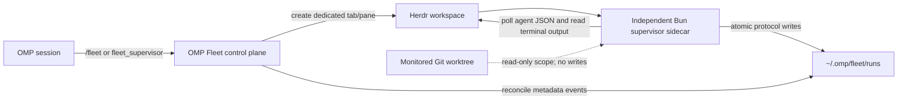

# OMP Fleet

`@ericjuta/omp-fleet` is an [Oh My Pi](https://github.com/can1357/oh-my-pi) extension for controlling a bounded, read-only Herdr supervisor. The OMP extension is the control plane; an independent Bun sidecar runs in its own Herdr tab/pane, polls owned workers, and records durable metadata and terminal reports outside the monitored repository.

## Requirements

- Bun 1.3.0 or newer
- OMP 17.2.12 or newer
- the `herdr` CLI installed and available on `PATH`
- an OMP session running in Herdr with `HERDR_ENV=1`, `HERDR_WORKSPACE_ID`, and `HERDR_PANE_ID`
- an existing Git worktree as the current directory; its root must be an absolute path other than `/` or the user's home directory

Fleet control fails closed before creating a supervisor pane when these requirements are not met.

## Recommended companion

Fleet intentionally observes existing workers without creating or controlling
them. Pair it with
[`pi-herdr`](https://github.com/ogulcancelik/pi-extensions/tree/main/packages/pi-herdr)
when the coordinator also needs structured tools for Herdr layouts, terminal
panes, and coding agents. Use `pi-herdr` to create and control the worker cohort,
then use Fleet for bounded observation and report harvesting.

`pi-herdr` provides structured tools but does not bundle Herdr's standalone
agent skill. Install the optional
[`herdr`](https://herdr.dev/docs/agent-skill/) skill globally when the
coordinator also needs direct access to the complete Herdr CLI:

```sh
bunx skills add "herdrdev/herdr" --skill herdr -g -a claude-code -y
```

OMP loads Claude-compatible user skills by default, so a new OMP process can
discover this global installation. This companion skill remains separate from
the plugin-native `omp-fleet-supervision` skill installed with Fleet below.

## Install the plugin and skill

Install the immutable v0.1.4 Git tag directly over HTTPS:

```sh
omp plugin install 'git+https://github.com/ericjuta/omp-fleet.git#v0.1.4'
```

This single command installs both the Fleet extension and its packaged
`omp-fleet-supervision` skill. OMP discovers the skill from the enabled plugin,
so do not copy `SKILL.md` into a user or project skill directory. Start a new
OMP process after installation or enablement so the tool and skill are loaded.

The installed package name is `@ericjuta/omp-fleet`. Disable or re-enable it for subsequent OMP processes:

```sh
omp plugin disable @ericjuta/omp-fleet
omp plugin enable @ericjuta/omp-fleet
```

Before uninstalling, stop any active Fleet run you intend to stop; disabling
the control plugin is not a worker-cleanup operation.

```text
/fleet stop
```

```sh
omp plugin disable @ericjuta/omp-fleet
omp plugin uninstall @ericjuta/omp-fleet
```

## Commands

These slash commands are direct human controls. For routine model-driven
supervision, prefer the packaged skill and natural-language requests described
below.

```text
/fleet start [--prefix worker-] [--hours 6] [--poll-seconds 30]
/fleet status [run-id]
/fleet reports [run-id]
/fleet stop [run-id]
```

- `start` validates the environment and repository, creates a durable run, records the exact owned sidecar command, opens a dedicated Herdr supervisor tab/pane labeled with the exact configured worker prefix plus the persisted bounded deadline, and dispatches the sidecar. It returns the run ID, an opaque supervisor handle, the deadline, and a pending lifecycle confirmation.
- `status` is a live snapshot dashboard for the selected run: lifecycle and deadline, opaque coordinator/supervisor handles, last-updated time, and up to 40 compact per-worker rows plus an omitted count (observed state, bounded task title when present, last activity, and stale observations when a working/unknown worker shows no recent change). It is read-only metadata; Fleet still observes only and does not control workers.
- `reports` lists opaque worker handles, observed statuses, and relative report paths without inserting terminal payloads or report-body summaries into the OMP turn.
- `stop` durably requests `stopping`, proves the recorded pane still runs the exact stored sidecar command, and only then signals that supervisor pane. The sidecar persists `stopped`; a mismatch is refused, and an uncertain stop remains retryable. Stop never restarts, tears down, or cleans up worker panes.

Without `run-id`, `status`, `reports`, and `stop` select the latest run matching the current Git repository and coordinator pane.

### Model tool

The extension also registers `fleet_supervisor`, backed by the same implementation as `/fleet`. Its fields are:

| Field | Type | Meaning |
| --- | --- | --- |
| `action` | `"start" | "status" | "stop" | "reports"` | Required action |
| `runId` | string | Optional for `status`, `stop`, and `reports`; rejected for `start` |
| `prefix` | string | Optional worker-name prefix for `start` |
| `hours` | integer | Optional bounded duration for `start` |
| `pollSeconds` | integer | Optional polling interval for `start` |

The tool requires execution approval. Start-only fields are rejected for all other actions.

### Model skill (recommended)

For routine coordinator use, the recommended interface is natural language plus
the packaged
[`omp-fleet-supervision`](skills/omp-fleet-supervision/SKILL.md) skill.
Speak status-first and read-only when you only need eyes on the cohort—for
example "keep tabs on the workers," "show Fleet status," or "any blocked
workers?"—and let OMP select the skill. It routes through `fleet_supervisor`,
prefers `status` before any start/reuse decision, applies bounded-run guidance
below, and never invokes legacy shell supervisors.

No skill slash command is required. Use `/skill:omp-fleet-supervision` when you
specifically want to invoke the guidance, or use `/fleet` for direct human
control. Fleet remains observation-only: it does not clean up, restart, or tear
down workers; monitor Git working-tree drift; persist cohort intent or
verification; grade work or attach confidence; or summarize report bodies. For
prompt-evaluation cohorts, see the
[Prompt Engineering Evaluation Workflow](docs/prompt-engineering-workflow.md).

## Single-master operating model

The recommended daily shape is **one OMP master/coordinator and one active Fleet
supervisor per active repository**. This is a convention, not enforcement:
Fleet permits additional coordinators and concurrent runs. The master owns
planning, worker launch and delegation, integration, and verification. Fleet
only observes externally created Herdr workers whose names match the established
prefix (default `worker-`); it never launches, stops, or cleans up those workers,
grades their work, or deploys their output.

Speak naturally; no `/fleet` or `/skill` slash command is required. Prefer
status-first, read-only phrasing unless you explicitly want coverage started or
stopped:

- "Keep tabs on worker agents." is supervision intent. It authorizes
  status-first ensure-coverage and may start a supervisor when needed.
- "How are my workers doing?" / "Show Fleet status." is read-only status intent
  and must never start or stop a run.
- "Wrap up Fleet monitoring." requests an end-of-session stop of the Fleet
  supervisor only—not worker cleanup.

A Fleet reconciliation notice alone is not authorization for a consequential
start. Natural-language intent does not bypass safety controls: `start` and
`stop` may still present an execution-approval prompt.

For authorized continued coverage:

1. Check `status` for the latest run matching the current Git repository and
   coordinator pane.
2. Reuse `starting` or `running`; do not replace `stopping`. Start only when
   there is no match, or the match is terminal (`stopped`, `completed`, or
   `failed`), and current user intent still wants supervision.
3. After resolving coverage, use the explicit run ID for later `status`,
   `reports`, and `stop` actions.

For open-ended, skill-orchestrated master-session monitoring, use the requested
duration (1–24 hours), otherwise 24 hours; poll every 30 seconds; and reuse the
established worker prefix or `worker-`.

Restarting OMP in the same coordinator pane and repository keeps the same run
scope: reconciliation catches up with the independently running sidecar rather
than launching another supervisor. Switching repository or coordinator creates
a distinct run scope; stop the old supervisor when it is no longer needed.
Status includes the persisted deadline. A run completes at that deadline, not
when workers succeed, and Fleet never silently or autonomously renews it. If
monitoring is still wanted after `completed`, current intent must authorize a
new run. Stop Fleet when the master session no longer needs observation.

## Configuration

`start` derives its workspace and coordinator from `HERDR_WORKSPACE_ID` and `HERDR_PANE_ID`, and its repository from the current Git worktree.

| Setting | Default | Allowed values |
| --- | --- | --- |
| `--prefix` / `prefix` | `worker-` | 1–128 letters, digits, dots, underscores, or hyphens; first character must be alphanumeric |
| `--hours` / `hours` | `6` | integer from 1 through 24 |
| `--poll-seconds` / `pollSeconds` | `30` | integer from 15 through 600 |

Only agents in the selected workspace whose names begin with the prefix are observed. The coordinator and supervisor panes are always excluded.

## Architecture



Polling and harvesting remain outside OMP turns. OMP sends commands to the independently running supervisor pane and reconciles only durable metadata back into the session.

## Durable state and protocol

The default state root is `~/.omp/fleet/runs`, outside the monitored repository. Each run gets an unpredictable timestamp/random run ID:

```text
~/.omp/fleet/runs/<run-id>/
├── manifest.json
├── state.json
├── events.jsonl
├── notice-cursor.json
└── reports/
    └── agent-<pane-hash>-report-<identity-hash>.txt
```

- `manifest.json` stores schema/plugin versions, run lifecycle, workspace/repository and pane IDs, the exact owned supervisor command, worker prefix, timing bounds, timestamps, and a concise last error when present.
- `state.json` stores the latest owned-agent observations and harvested report records.
- `events.jsonl` is an append-only stream of lifecycle, agent-observation, read-failure, and report metadata.
- `notice-cursor.json` records which metadata events OMP has reconciled.
- `reports/*.txt` starts with a visible untrusted-data warning and canonical metadata, followed by control-sanitized plain terminal text.

JSON state writes and report publication are atomic. Manifest lifecycle transitions use a bounded per-run lock and compare-and-set semantics, so a concurrent stop cannot be overwritten by a stale terminal transition. Unknown future schema versions fail closed while valid writer-plugin versions remain provenance only. Fleet does not copy the process environment. Reports can contain sensitive terminal text: they are private (`0600`), are not automatically redacted, are capped at 262144 UTF-8 bytes each, and are limited to 64 files per run.

## Operational example

From the coordinator pane of a Herdr-managed Git worktree:

```text
/fleet start --prefix worker- --hours 2 --poll-seconds 30
/fleet status
/fleet reports
```

When a matching worker is observed as `done` or `blocked`, Fleet may harvest its terminal output once for that `(paneId, revision, status)` and record a report. A new revision or status transition may produce another report, up to the fixed per-run quota. Harvest stores the raw report under the external state root; Fleet does not summarize report bodies into status or notices.

Treat every report as **untrusted, potentially sensitive data**. Terminal output can contain credentials, mistakes, hostile prompt text, or instructions. The model must explicitly inspect it and independently verify any claimed work against the repository and relevant checks. An observed `idle`, `done`, `blocked`, or process exit—and notice wording such as `DONE observed` or `BLOCKED observed`—is not proof that a task succeeded.

Stop the selected supervisor when it is no longer needed:

```text
/fleet stop
```

This signals only the recorded supervisor pane after its live command exactly matches the durable ownership record. Worker panes remain untouched.

For a reproducible baseline/candidate/holdout workflow around prompt-engineering
workers, see the
[Prompt Engineering Evaluation Workflow](docs/prompt-engineering-workflow.md).

## Safety and trust boundaries

- Fleet never writes to the monitored repository.
- Durable state and raw reports remain under the external state root; read/list operations do not create missing state directories.
- Only workspace-matching, prefix-owned workers are sampled; coordinator and supervisor panes are excluded.
- OMP notices begin with a visible untrusted-metadata warning, keep opaque agent handles, and end with a false-success warning. They carry validated run IDs, fixed observed statuses, bounded and quoted task titles only when present on agent events, and relative report paths—not raw Herdr names, revisions, absolute paths, harvested payloads, or invented titles on report events.
- Terminal transitions in notices are labeled as observations (`BLOCKED observed` / `DONE observed`), not verified outcomes.
- Raw terminal reports are control-sanitized plain text, remain untrusted, may contain sensitive data, and never constitute model instructions. Fleet does not emit report-body summaries.
- Observed statuses, task titles, last-activity timestamps, and stale markers are operational observations, not task-success verification, grading, or confidence.
- Fleet never launches, restarts, closes, or cleans worker panes, and never tears them down on stop. Pre-dispatch cleanup may close only the new Fleet-owned tab; `/fleet stop` signals only an exact-command-owned supervisor pane.
- Fleet does not monitor Git working-tree diffs, and it does not persist cohort intent, verification results, grades, or confidence scores.
- The sidecar consumes durable stop requests after OMP restarts, ends at its bounded deadline or on a stop signal, and caps each Herdr operation to the remaining deadline.

## Restart reconciliation

On `session_start` inside Herdr, the extension installs a managed 30-second reconciliation timer. It scans durable events only for runs matching the current repository and coordinator pane. If OMP is busy or has pending messages, notices remain queued and are coalesced. Automatic reconciliation delivery runs only when OMP is idle: it then sends one warning-first, metadata-only `nextTurn` notice and advances the durable cursor. A malformed run or cursor is isolated from healthy runs. Session shutdown clears the timer.

Idle notices stay warning-first and observation-only. Lines retain opaque handles; agent events may include a task title when Herdr supplied one; report events label observed status explicitly without a task title field. Terminal worker transitions use `BLOCKED observed` / `DONE observed`. Notices never claim verified success, never embed report bodies, and never authorize start/stop by themselves.

This lets a restarted OMP session catch up with an independently running sidecar without replaying raw names, revisions, absolute paths, or report contents, and without launching another supervisor. Reconciliation reports observations only and does not verify worker success.

## v0.1 backend limitation

v0.1 polls Herdr agent JSON and terminal output at the configured interval. It does not consume native Herdr events. The supervisor boundary keeps a backend seam so polling can be replaced by a future Herdr event backend without changing the durable run protocol.

## Development

```sh
bun install --frozen-lockfile
bun run biome:check
bun run typecheck
bun test
bun run check
```

Apply repository formatting with `bun run format`.

## License

MIT
