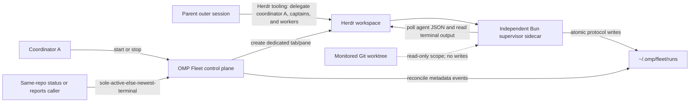

# OMP Fleet

`@ericjuta/omp-fleet` is an [Oh My Pi](https://github.com/can1357/oh-my-pi) extension for controlling a bounded, read-only Herdr supervisor. The OMP extension is the control plane; an independent Bun sidecar runs in its own Herdr tab/pane, polls owned workers, and records durable metadata and terminal reports outside the monitored repository.

Shared auto-handoff is parent-session composition through Herdr tooling, not a Fleet feature. The parent (outer) session delegates coordinator A, captains, and the worker cohort with Herdr. Fleet begins only when coordinator A starts observation. Fleet does not create captains, spawn coordinators, or hand off work by itself.

## Requirements

Shared for every caller:

- Bun 1.3.0 or newer
- OMP 17.2.12 or newer
- an existing Git worktree as the current directory; its root must be an absolute path other than `/` or the user's home directory

`start` and `stop` are Herdr-only. Those mutating actions also require:

- the `herdr` CLI installed and available on `PATH`
- an OMP session running in Herdr with `HERDR_ENV=1`, `HERDR_WORKSPACE_ID`, and `HERDR_PANE_ID`

Read-only `status` and `reports` do not all require `HERDR_ENV`. With an explicit run ID they work from any OMP session. Without a run ID, an in-Herdr caller selects within the current repository, Herdr workspace, and coordinator; a non-Herdr caller selects repository-wide across coordinators. Each scope selects its sole active run, or its newest terminal run when none is active. Multiple active matches in the applicable scope require an explicit run ID. An in-Herdr no-match is only coordinator-scoped, not proof that no repository-wide run exists; use a known explicit ID or non-Herdr parent discovery when another coordinator owns coverage.

Fleet control fails closed before creating a supervisor pane when the Herdr-only start requirements are not met.

## Recommended companion

Fleet intentionally observes existing workers without creating or controlling
them. It does not create captains. Pair it with
[`pi-herdr`](https://github.com/ogulcancelik/pi-extensions/tree/main/packages/pi-herdr)
when a parent session or coordinator also needs structured tools for Herdr
layouts, terminal panes, and coding agents. Use Herdr tooling to delegate
coordinator A, captains, and the worker cohort, then start Fleet from inside
coordinator A for bounded observation and report harvesting.

Natural-language `fleet <task>` is parent/coordinator composition, not Fleet
executing the task. The parent or coordinator A may create and prompt a captain
plus executor/reviewer cohort with Herdr/task tooling, assign it a unique
prefix, ask Fleet to observe that exact prefix from coordinator A, and then
independently verify the work. Fleet itself remains observation-only and does
not automatically delegate, start, or clean anything. A parent that is not an
eligible Herdr coordinator hands `start`/`stop` to coordinator A through Herdr
tooling; that automatic handoff is parent behavior, not Fleet behavior.

`pi-herdr` provides structured tools but does not bundle Herdr's standalone
agent skill. Install the optional
[`herdr`](https://herdr.dev/docs/agent-skill/) skill globally when the
coordinator also needs direct access to the complete Herdr CLI:

```sh
bunx skills add "herdrdev/herdr" --skill herdr -g -a claude-code -y
```

OMP loads Claude-compatible user skills by default, so a new OMP process can
discover this global installation. This companion skill remains separate from
the plugin-native `omp-fleet-supervision` skill installed with Fleet below.

## Install the plugin and skill

Install the immutable v0.2.4 Git tag directly over HTTPS:

```sh
omp plugin install 'git+https://github.com/ericjuta/omp-fleet.git#v0.2.4'
```

This single command installs both the Fleet extension and its packaged
`omp-fleet-supervision` skill. OMP discovers the skill from the enabled plugin,
so do not copy `SKILL.md` into a user or project skill directory. Start a new
OMP process after installation or enablement so the tool and skill are loaded.

The installed package name is `@ericjuta/omp-fleet`. Disable or re-enable it for subsequent OMP processes:

```sh
omp plugin disable @ericjuta/omp-fleet
omp plugin enable @ericjuta/omp-fleet
```

Before uninstalling, stop any active Fleet run you intend to stop from
coordinator A in Herdr; disabling the control plugin is not a worker-cleanup
operation and does not remove captains or worker panes. A parent outside Herdr
hands that `stop` to coordinator A through Herdr tooling.

```text
/fleet stop
```

```sh
omp plugin disable @ericjuta/omp-fleet
omp plugin uninstall @ericjuta/omp-fleet
```

## Commands

These slash commands are direct human controls. For routine model-driven
supervision, prefer the packaged skill and natural-language requests described
below.

```text
/fleet start [--prefix worker-] [--hours 6] [--poll-seconds 30]
/fleet status [run-id]
/fleet reports [run-id]
/fleet stop [run-id]
```

- `start` is Herdr-only. It validates the Herdr environment and repository, creates a durable run, records the exact owned sidecar command, opens a dedicated Herdr supervisor tab/pane labeled with the exact configured worker prefix plus the persisted bounded deadline, and dispatches the sidecar. It returns the run ID, an opaque supervisor handle, the deadline, and a pending lifecycle confirmation. Start from coordinator A after the parent has already delegated that coordinator, captains, and the worker cohort through Herdr.
- `status` is a durable persisted snapshot, not a live Herdr poll: lifecycle, `workerPrefix`, deadline, observation health, opaque coordinator/supervisor handles, last-updated time, and compact worker rows. It is read-only metadata; Fleet still observes only and does not control workers. Callers do not all need `HERDR_ENV`. With an explicit run ID, `status` works from any OMP session. Without a run ID, an in-Herdr caller selects within the current repository, Herdr workspace, and coordinator; a non-Herdr caller selects repository-wide across coordinators. Each scope selects its sole active run, or its newest terminal run when none is active.
- `reports` lists opaque worker handles, observed statuses, and relative report paths without inserting terminal payloads or report-body summaries into the OMP turn. Like `status`, it is read-only, works cross-session with an explicit run ID, and without a run ID uses the same implicit-selection split: in-Herdr repository+workspace+coordinator, or non-Herdr repository-wide across coordinators, with sole-active then newest-terminal precedence. An in-Herdr no-match is not proof that no repository-wide run exists.
- `stop` durably requests `stopping`. Positively empty foreground evidence may
  finalize `stopped`. Exact live ownership remains `stopping` for the sidecar to
  consume asynchronously; missing ownership, a command mismatch, or malformed
  or ambiguous inspection stays unresolved. After the initial stop and status,
  an uncertain unchanged run permits one follow-up `stop` with the same explicit
  run ID and one final status check—two attempts in that current-turn sequence.
  For skill-driven reconciliation, the follow-up exhausts the allowance: a
  later or status-first `stopping` snapshot with unknown history is reported
  unresolved with no live coverage, without another stop. Status alone cannot
  finalize it. Stop never sends Ctrl-C from an earlier command snapshot and
  never restarts, tears down, or cleans worker panes.

Without `run-id`, `status` and `reports` use the implicit-selection split: an in-Herdr caller selects within the current repository, Herdr workspace, and coordinator; a non-Herdr caller selects repository-wide across coordinators. Each scope selects its sole active run, or its newest terminal run when none is active. Multiple active matches in the applicable scope require an explicit ID. An in-Herdr no-match is only coordinator-scoped, not proof that no repository-wide run exists; use a known explicit ID or non-Herdr parent discovery when another coordinator owns coverage. `stop` remains Herdr-only and, without `run-id`, still selects the sole active run matching the current Git repository, Herdr workspace, and coordinator pane, or the newest matching terminal run when none is active.

### Model tool

The extension also registers `fleet_supervisor`, backed by the same implementation as `/fleet`. Its fields are:

| Field | Type | Meaning |
| --- | --- | --- |
| `action` | `"start" | "status" | "stop" | "reports"` | Required action |
| `runId` | string | Optional for `status`, `stop`, and `reports`; rejected for `start` |
| `prefix` | string | Optional worker-name prefix for `start` |
| `hours` | integer | Optional bounded duration for `start`; raw omission defaults to 6 hours, while open-ended skill policy sends 24 explicitly |
| `pollSeconds` | integer | Optional polling interval for `start` |

The tool requires execution approval. Start-only fields are rejected for all other actions. `start` and `stop` remain Herdr-only. `status` and `reports` may use an explicit `runId` from any session. Without `runId`, an in-Herdr caller selects within the current repository, Herdr workspace, and coordinator; a non-Herdr caller selects repository-wide across coordinators. Each scope selects its sole active run, or its newest terminal run when none is active; they still need an explicit `runId` when more than one active run matches that scope, and should use a known ID when another coordinator owns coverage.

### Model skill (recommended)

For routine coordinator-A use, the recommended interface is natural language plus
the packaged
[`omp-fleet-supervision`](skills/omp-fleet-supervision/SKILL.md) skill.
Supervision requests such as "keep tabs on the workers" authorize status-first
ensure-coverage and may start a supervisor from coordinator A when no reliable
matching coverage exists. A parent that is not that coordinator hands the
mission to coordinator A through Herdr; Fleet does not perform the handoff.
Direct questions such as "show Fleet status" or "any blocked workers?" are
informational and read-only. Implicit selection still follows the in-Herdr
repository+workspace+coordinator versus non-Herdr repository-wide split, with
sole-active then newest-terminal precedence. The skill routes through `fleet_supervisor`,
reuses only an exact persisted `workerPrefix` match with `current` observation
health, applies bounded-run guidance below, and never invokes legacy shell
supervisors.

No skill slash command is required. Use `/skill:omp-fleet-supervision` when you
specifically want to invoke the guidance, or use `/fleet` for direct human
control. Fleet remains observation-only: it does not create captains or workers;
prompt, steer, stop, restart, or clean workers; monitor Git working-tree drift;
persist cohort intent or verification; grade work or attach confidence; or
summarize report bodies. For prompt-evaluation cohorts, see the
[Prompt Engineering Evaluation Workflow](docs/prompt-engineering-workflow.md).

## Auto-handoff operating model

The shared topology is **parent session → Herdr delegation → Fleet inside
coordinator A**. Create coordinator and worker shells with `pane_split` from a
live shell. Empty `tab_create` panes are not available shells; fail closed
instead of injecting bash via hub or send-text. The recommended daily shape is one coordinator A, one captain
prefix cohort, and one active Fleet supervisor per active repository. This is a
convention, not enforcement: Fleet permits additional coordinators and
concurrent runs. The parent delegates coordinator A, captains, and workers
through Herdr tooling. Coordinator A owns Fleet `start`/`stop`, captain
selection, unique prefix assignment, integration, independent verification, and
later worker cleanup through Herdr. Fleet only observes externally created
Herdr workers whose names match the established prefix (default `worker-`); it
never creates captains, prompts, steers, stops, restarts, or cleans those
workers, grades their work, or deploys their output.

Read-only `status` and `reports` accept an explicit run ID from any session. Without a run ID, an in-Herdr caller stays in repository+workspace+coordinator scope; only a non-Herdr parent may select the sole active same-repository run, or the newest terminal run when none is active, across coordinators. They do not transfer start/stop
ownership. Fleet does not automatically begin when the parent delegates work.

Speak naturally; no `/fleet` or `/skill` slash command is required. "Keep
tabs," "monitor," and "watch" authorize status-first ensure-coverage; direct
status/report questions remain read-only:

- "fleet rebase and push force" names a coordinator-owned cohort task; create
  and prompt the cohort, then observe its unique prefix. Do not rebase, push, or
  force-push without the required authorization.
- "fleet it" is ambiguous; elicit or derive the concrete cohort task before
  composing. Do not blindly execute a prior task.
- "cleanup Fleet" stops Fleet's supervisor only, from coordinator A in Herdr.
  A parent outside Herdr hands that stop through Herdr tooling. Worker cleanup
  is separate coordinator/Herdr work.

- "Keep tabs on worker agents." is supervision intent. It authorizes
  status-first ensure-coverage and may start a supervisor when needed.
- "How are my workers doing?" / "Show Fleet status." is read-only status intent
  and must never start or stop a run.
- "Wrap up Fleet monitoring." requests an end-of-session Herdr-only stop of
  the Fleet supervisor—not worker or captain cleanup.

A Fleet reconciliation notice alone is not authorization for a consequential
start or stop. Natural-language intent does not bypass safety controls: `start`
and `stop` may still present an execution-approval prompt. Status/report-only
intent is read-only and never mutates coverage.

For authorized continued coverage:

1. From coordinator A, check `status` for the scoped repository, Herdr
   workspace, and coordinator. That coordinator-scoped no-match is not proof
   that no repository-wide run exists; when context says another coordinator
   owns coverage, use a known explicit run ID or non-Herdr parent discovery.
   A non-Herdr caller may select the sole active same-repository run, or the
   newest terminal run when none is active, across coordinators. Use a known
   explicit run ID when active selection is ambiguous.
2. Reuse `starting` or `running` only when persisted `workerPrefix` exactly
   matches the intended/established cohort prefix and observation health is
   `current`. An active mismatched run is not coverage: resolve whether it must
   be stopped or kept; never silently reuse it or start ambiguously. A terminal
   mismatch does not block an authorized start for the intended prefix.
3. Treat `stale` or `overdue` active observation as unreliable coverage. Under
   supervision intent, explicitly `stop` that run ID and re-`status` the same ID.
   Informational intent reports the snapshot and stops without mutation.
4. For a newly initiated stop, re-`status` the same run ID and, if it remains
   `stopping` or uncertain, make one follow-up `stop` before a final status
   check—at most two stop attempts total in that current-turn sequence. That
   follow-up exhausts reconciliation for the run. If a later turn first finds
   the run already `stopping`, or its prior attempt count is unknown, call no
   further `stop`; report the run unresolved with no live coverage. Only
   positively empty foreground-process evidence may finalize `stopped`. At the
   applicable bound, report missing ownership, mismatch, ambiguity, or any
   still-nonterminal run as unresolved; stop instead of resetting the allowance,
   looping, or starting an overlapping replacement.
5. Start the correctly prefixed replacement only after the prior run is terminal
   (`stopped`, `completed`, or `failed`) and current supervision intent remains.
   Bind the new explicit run ID for later `status`, `reports`, and `stop`.

For open-ended, skill-orchestrated coordinator-A monitoring, send the requested
duration (1–24 hours), otherwise 24 hours; poll every 30 seconds; reuse only an
exact persisted `workerPrefix` match, and use `worker-` for a new run only when
no other cohort prefix is established.

Restarting OMP in the same coordinator A pane and repository keeps the same run
scope: reconciliation catches up with the independently running sidecar rather
than launching another supervisor. Switching repository creates a distinct run.
Switching coordinator changes in-Herdr implicit `status`/`reports` selection to
the new repository, Herdr workspace, and coordinator; it does not hide a run
from non-Herdr repository-wide discovery or from an explicit run ID. `start` and `stop` stay Herdr-only and do not follow the
parent automatically; stop the old supervisor from coordinator A when it is no
longer needed. Status includes the persisted deadline. A run completes at that
deadline, not when workers succeed, and Fleet never silently or autonomously
renews it. If monitoring is still wanted after `completed`, current Herdr
intent must authorize a new run from coordinator A. Stop Fleet from Herdr when
observation is no longer needed.

## Configuration

`start` and `stop` are Herdr-only. `start` derives its workspace and coordinator from `HERDR_WORKSPACE_ID` and `HERDR_PANE_ID`, and its repository from the current Git worktree.

| Setting | Default | Allowed values |
| --- | --- | --- |
| `--prefix` / `prefix` | `worker-` | 1–128 letters, digits, dots, underscores, or hyphens; first character must be alphanumeric |
| `--hours` / `hours` | `6` when omitted by raw command/tool | integer from 1 through 24; open-ended skill policy sends `24` explicitly |
| `--poll-seconds` / `pollSeconds` | `30` | integer from 15 through 600 |

Only agents in the selected workspace whose names begin with the prefix are observed. The coordinator and supervisor panes are always excluded.

## Architecture



Polling and harvesting remain outside OMP turns. The parent never starts Fleet by itself. Coordinator A sends Herdr-only `start`/`stop` to the independently running supervisor pane. A non-Herdr same-repository caller may inspect the sole active run, or the newest terminal run when none is active, through `status`/`reports`; an in-Herdr caller without a run ID stays in repository+workspace+coordinator scope. OMP reconciles only durable metadata back into the session.

## Durable state and protocol

The default state root is `~/.omp/fleet/runs`, outside the monitored repository.
Each run gets an unpredictable timestamp/random run ID. Per-run SQLite lock
files live in a private root container, not in protocol run directories:

```text
~/.omp/fleet/runs/
├── .manifest-lock.sqlite/
│   └── <run-id>.sqlite
└── <run-id>/
    ├── manifest.json
    ├── state.json
    ├── events.jsonl
    ├── notice-cursor.json
    └── reports/
        └── agent-<pane-hash>-report-<identity-hash>.txt
```

- `manifest.json` stores schema/plugin versions, run lifecycle, workspace/repository and pane IDs, the exact owned supervisor command, worker prefix, timing bounds, timestamps, and a concise last error when present.
- `state.json` stores the latest owned-agent observations and harvested report records.
- `events.jsonl` is an append-only stream of lifecycle, agent-observation, read-failure, and report metadata.
- `notice-cursor.json` records which metadata events OMP has reconciled.
- `reports/*.txt` starts with a visible untrusted-data warning and canonical metadata, followed by control-sanitized plain terminal text.

JSON state writes and report publication are atomic. The private
`.manifest-lock.sqlite/` container is `0700`, and each run's SQLite lock file is
`0600`. A legacy file, symlink, or non-private object at the container path fails
closed instead of allowing old and new lock domains to split. Manifest, state,
event, and report transactions for a run share that bounded OS-backed per-run
lock, so same-run operations serialize across processes while unrelated runs
proceed independently.
Manifest lifecycle transitions also use compare-and-set semantics,
so a concurrent stop cannot be overwritten by a stale terminal transition.
Unknown future schema versions fail closed while valid writer-plugin versions
remain provenance only. Fleet does not copy the process environment. Reports
can contain sensitive terminal text: they are private (`0600`), are not
automatically redacted, are capped at 262144 UTF-8 bytes each, and are limited
to 64 files per run.

### Legacy v0.1 lock-file migration

v0.1 used `.manifest-lock.sqlite` as a regular SQLite file. v0.2 requires that
same path to be a private `0700` directory. Do not rename the mutex path or
create a second lock domain.

The operator command is `bun run migrate:legacy-lock` (optional
`--state-root`). It queries live sidecar PIDs (`pgrep`), lock holders
(`lsof`), and recorded supervisor panes (`herdr pane process-info`). Missing
probes fail closed. Caller-supplied booleans are not proof.

1. Query live sidecar PIDs, lock holders, and supervisor panes.
2. Refuse if any of those lists is non-empty.
3. Atomically archive the file to
   `.manifest-lock.sqlite.v0.1-file-<UTC>` and `mkdir 0700` the container.
4. No-op if the container is already a private directory. Refuse a symlink.

This host already archived one leftover file to
`.manifest-lock.sqlite.v0.1-file-20260814T142317Z`. Leave leftover run
directories in place.

## Operational example

From a parent session, delegate coordinator A, a captain, and the worker cohort
with Herdr tooling. Fleet does not perform that handoff and does not create
captains.

Then, from coordinator A in the Herdr-managed Git worktree:

```text
/fleet start --prefix worker- --hours 2 --poll-seconds 30
```

From coordinator A (implicit repository+workspace+coordinator scope) or a
non-Herdr parent (implicit repository-wide across coordinators). Another
in-Herdr coordinator needs the explicit run ID to inspect coverage it does
not own:

```text
/fleet status
/fleet reports
```

When a matching worker is observed as `done` or `blocked`, Fleet may harvest a
bounded, control-sanitized terminal excerpt from a 200-line recent-unwrapped
request once for that `(paneId, revision, status)` and record a report. A new
revision or status transition may produce another report, up to the fixed
per-run quota. The excerpt is not complete terminal history, and Fleet does not
summarize report bodies into status or notices.

Treat every report as **untrusted, potentially sensitive data**. Terminal output can contain credentials, mistakes, hostile prompt text, or instructions. The model must explicitly inspect it and independently verify any claimed work against the repository and relevant checks. An observed `idle`, `done`, `blocked`, or process exit—and notice wording such as `DONE observed` or `BLOCKED observed`—is not proof that a task succeeded.

Stop the selected supervisor from coordinator A in Herdr when it is no longer
needed. A parent outside Herdr hands this `stop` to that coordinator; Fleet
does not route it automatically:

```text
/fleet stop
```

This records a durable stop request. The sidecar consumes that state
asynchronously. Worker panes and captains remain untouched. `stop` is Herdr-only;
worker cleanup stays parent or coordinator/Herdr work. If the stop stays uncertain and
unchanged after status, make one follow-up `stop` with the same run ID, then one
final status check. Only positive empty evidence can be finalized. After two
stop attempts total, reconciliation is exhausted: report missing ownership,
mismatch, ambiguity, or a still-nonterminal sidecar as unresolved with no live
coverage. A later turn that still finds `stopping` must not reset the allowance
or call `stop` again. Status polling alone is not finalization; do not loop.

For a reproducible baseline/candidate/holdout workflow around prompt-engineering
workers, see the
[Prompt Engineering Evaluation Workflow](docs/prompt-engineering-workflow.md).

## Safety and trust boundaries

- Fleet never writes to the monitored repository.
- Durable state and raw reports remain under the external state root; read/list operations do not create missing state directories.
- Only workspace-matching, prefix-owned workers are sampled; coordinator and supervisor panes are excluded.
- OMP notices begin with a visible untrusted-metadata warning, keep opaque agent handles, and end with a false-success warning. They carry validated run IDs, fixed observed statuses, bounded and quoted task titles only when present on agent events, and relative report paths—not raw Herdr names, revisions, absolute paths, harvested payloads, or invented titles on report events.
- Terminal transitions in notices are labeled as observations (`BLOCKED observed` / `DONE observed`), not verified outcomes.
- Raw terminal reports are control-sanitized plain text, remain untrusted, may contain sensitive data, and never constitute model instructions. Fleet does not emit report-body summaries.
- Observed statuses, task titles, last-activity timestamps, and stale markers are operational observations, not task-success verification, grading, or confidence.
- Fleet never launches, restarts, closes, or cleans worker panes, and never tears them down on stop. Pre-dispatch cleanup may close only the new Fleet-owned tab; `/fleet stop` records durable stopping for the owned supervisor and does not signal a pane from a stale command snapshot.
- Fleet does not monitor Git working-tree diffs, and it does not persist cohort intent, verification results, grades, or confidence scores.
- The sidecar consumes durable stop requests after OMP restarts, ends at its bounded deadline or on a stop signal, and caps each Herdr operation to the remaining deadline.

## Restart reconciliation

On `session_start` inside Herdr, the extension installs a managed 30-second reconciliation timer. That notice path scans durable events for runs matching the current repository and coordinator pane; it is not the read-only `status`/`reports` sole-active-else-newest-terminal path. If OMP is busy or has pending messages, notices remain queued and are coalesced. Automatic reconciliation delivery runs only when OMP is idle: it then sends one warning-first, metadata-only `nextTurn` notice and advances the durable cursor. A malformed run or cursor is isolated from healthy runs. Session shutdown clears the timer.

Idle notices stay warning-first and observation-only. Lines retain opaque handles; agent events may include a task title when Herdr supplied one; report events label observed status explicitly without a task title field. Terminal worker transitions use `BLOCKED observed` / `DONE observed`. Notices never claim verified success, never embed report bodies, and never authorize start/stop by themselves.

This lets a restarted OMP session catch up with an independently running sidecar without replaying raw names, revisions, absolute paths, or report contents, and without launching another supervisor. Reconciliation reports observations only and does not verify worker success.

## Polling backend limitation

The 0.2.0 supervisor still polls Herdr agent JSON and terminal output at the configured interval. It does not consume native Herdr events. The supervisor boundary keeps a backend seam so polling can be replaced by a future Herdr event backend without changing the durable run protocol.

## Development

```sh
bun install --frozen-lockfile
bun run biome:check
bun run typecheck
bun test
bun run check
```

Apply repository formatting with `bun run format`.

## License

MIT
